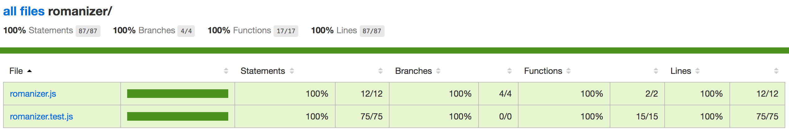

# Test Coverage
## What is test coverage?
**Test coverage** is a measure of how much of the code you've written is being executed when you run your _testing framework_.

So if your test coverage is 100%, every line of your code is invoked when you are running your tests.

## Why is test coverage useful?
If you have code that isn't tested when you run your test framework, it can create several problems:

* untested code can behave in unexpected ways, creating **bugs**
* untested features can be difficult to maintain without making changes that **break the rest of the code**
* untested code, if it's not needed, can **clutter** a project and **create more problems** if you need to fix it later on

## What are Istanbul and nyc?

Istanbul is a code coverage analysis script you run when executing your unit tests which prints out simple html reports.

nyc is a command-line-client for Istanbul. nyc can run with more complicated test frameworks than a single document of javascript tests.

How to install nyc:
-------------------

> npm i nyc --save-dev

Insert the below line into the scripts section of your package.json and run:

> {   "script": {
>     "test": "nyc mocha"   } }

However, we found it easier to install it globally:

> npm i nyc -g

Then we can use it to execute npm test without making changes to the package.json:

> nyc npm test

nyc accepts a wide variety of configuration arguments, run nyc --help for thorough documentation.

Configuration arguments should be provided prior to the program that nyc is executing. As an example, the following command executes npm test, and indicates to nyc that it should output both an lcov and a text-lcov coverage report. This would be to be able to see it within your browser instead of just the command line:

> nyc --reporter=lcov --reporter=text-lcov npm test

How to install instanbul:
-------------------------

> npm install istanbul --save-dev

Now run the istanbul command to generate a coverage report:

> node ./node_modules/.bin/istanbul cover romaniser.test.js

Alternatively you can insert the below line into the scripts section of your package.json and run:

> "coverage": "istanbul cover ./romaniser.test.js"
>
> npm run coverage

This will create a directory in your project called coverage where you will find the generated coverage reports.

How istanbul works:
--------------------

Istanbul gives us four code coverage metrics:

**Statements**: How many of the statements in you code are executed.

**Branches**: Conditional statements create branches of code which may not be executed (e.g. if/else). This metric tells you how many of your branches have been executed. This is also quite unique to istanbul.

**Functions**: The proportion of the functions you have defined which have been called.

**Lines**: The proportion of lines of code which have been executed.

We can view the % coverage for each of these metrics and use them to improve our tests.

In our TDD romaniser example we have 100% coverage because all of our code is being used (none is superfluous).

## Use Istanbul/nyc to calculate your code coverage for the TDD workshop.
See demonstration! Code is in [this repo](https://github.com/astroash/romanizer).

Here's Istanbul in use in a browser:

## Useful resources
* DWYL's [Istanbul workshop](https://github.com/dwyl/learn-istanbul) shows how to install Istanbul as well as going into more details about test coverage.
* Even more detail on [Test Coverage](http://www.softwaretestingclass.com/test-coverage-in-software-testing/).
* More information from [Medium](https://medium.com/@novemberborn/code-coverage-with-babel-istanbul-nyc-83b8c2f1093) about how to use Istanbul and nyc.
