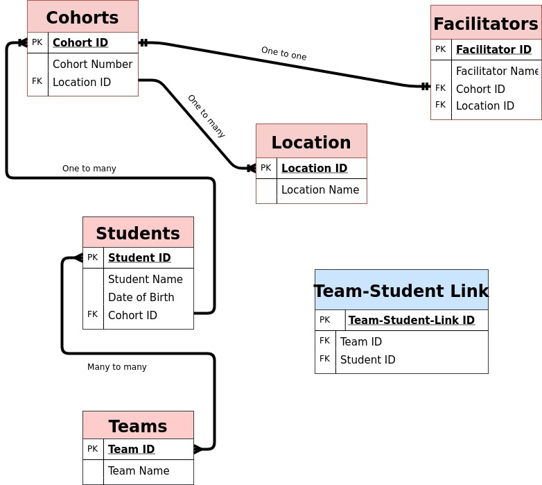

## What is a schema and why/when would you need one?
There are two types of schema - logical and physical. We focus on logical schema, before briefly explaining physical schema.

A logical schema is like an architect's blueprint of our database. It contains all the information required to configure it. In our schema we will include:
 - names of tables
 - names of the fields within those tables
 - relationships between fields in different tables

It is important to **carefully plan out** your logical schema before creating a database as it is difficult to change once the database is in use.

The physical schema is the structure and layout of the database in practice - how it's actually stored.
***
## What are primary keys and why do we need them?
A primary key is a number which the database uses to link one table with another. It is a **unique, autoincrementing ID** which is filled in by the database - in other words it is **NEVER NULL**. A primary ID number will only ever be issued once; if, for example, you delete the latest record with an ID of `7` in your table `FAC`, and then make a new record, the new record's ID will become `8`. This is **really useful**! If we need to refer to a record in separate table, we can import this ID as a **foreign key**, to be sure we are referring to the **actual record**.

## A mock database schema for FAC

