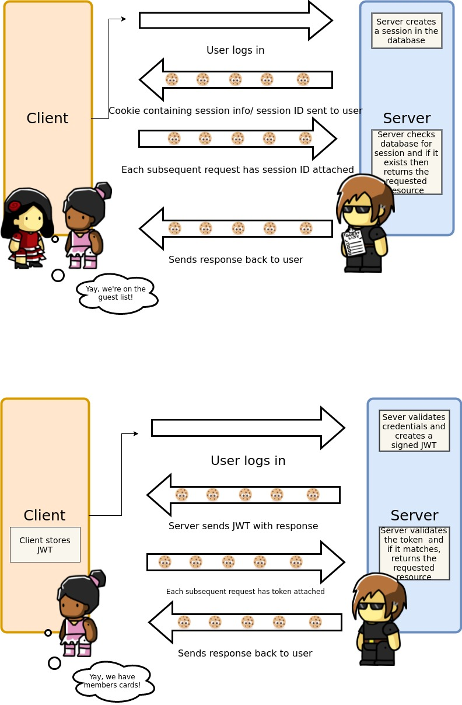

# Stateless vs stateful authentication :lock:

## What is session based authentication (stateful)?
The server does all the heavy lifting: when a user logs in, the server creates a session ID for that user, stores it server-side and sends it to the client (e.g. in a cookie). Each time a user requests a page the client attaches this session ID to the request, and it is checked against the server's list of session IDs. 

Each session ID is associated with a user (this might be stored in a database on the server). The server can limit this session to certain operations, allowing users to have different permissions.

There is nothing fancy about this session ID. It is just an identifier and the server does everything else. 

#### So to summarise...
* unique session IDs are created and stored server side
* all user information is stored server side
* it associated the identifier with a user account

## What is token based authentication (stateless)?

This allows users to enter their username and password in order to obtain a token which allows them to fetch a specific resource - without using their username and password.

Once their token has been obtained, the user can offer the token - which offers access to a specific resource for a time period - to the remote site.

The user only has to authenticate with username and password once (within a session of limited duration), and uses their time-limited token for further authentication during the session.

#### So to summarise...
* a token is a piece of data created by the server
* the token contains information to identify a particular user and token validity
* the client stores the token and sends it along with every request
* the server verifies token and responds with data

## Flow diagrams:

To show the steps involved in each process.

## What are the advantages and disadvantages of each?

| Stateful |  | Stateless | |
| -------- | -------- | -------- |-------- |
| Advantages    | Disadvantages    | Advantages     |Disadvantages     |
| Session ids are usually small  |Data is centralised which means that getting data from the central store for every operation can be troublesome. | Users can pass the token on to other automated systems which they're willing to trust for a limited time and a limited set of resources, but would not be willing to trust with their username and password (i.e., with every resource they're allowed to access)     | Tokens carrying a payload can be expected to be bigger than session ids. As these tokens are part of every call, there exists a point at which the overhead of the additional data becomes problematic    |
|    |Every time a user is authenticated, the server will need to create a record somewhere on the server. This is usually done in memory and when there are many users authenticating, the overhead on your server increases.     | Having a token carry a certain payload reduces chattiness in the backend     |     |
|    |     | A client cannot manipulate the state     |     |
|    |     | More secure - there is no session based information to manipulate     |     |

## Links
[Session Authentication vs Token Authentication](https://security.stackexchange.com/questions/81756/session-authentication-vs-token-authentication)
[Stateless Auth for Stateful Minds - Nice descriptions and pros of stateful](https://auth0.com/blog/stateless-auth-for-stateful-minds/)
[What is a stateless protocol?](https://en.wikipedia.org/wiki/Stateless_protocol)
[The Ins and Outs of Token Based Authentication](https://scotch.io/tutorials/the-ins-and-outs-of-token-based-authentication)

## Questions for the room!
1. Where are authentication tokens stored - client side or server side and what are the benefits?

2. Describe a disadvantage of stateful authentication.

3. 
